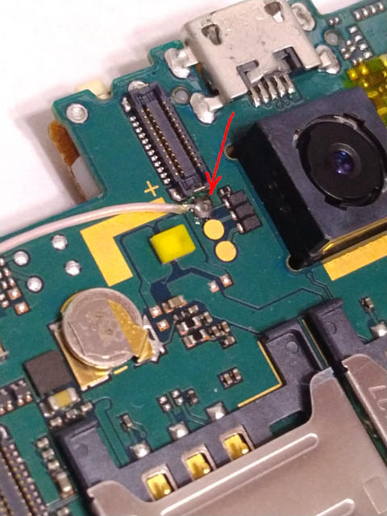

# Summary
| key           | value                                                                                                                             |
|---------------|-----------------------------------------------------------------------------------------------------------------------------------|
| SoC           | MT6589WTK 1325-ATAH DTNGT126                                                                                                      |
| Device        | Highscreen Alpha R                                                                                                                |
| Software used | [brom-dump (spft-replay, payloads)](https://github.com/arzam16/empty-sixty-five), commit d8659844eb8e1c8c25e83e04ec9645b874704072 |

# Regions
| File name  | Name | Memory address |
|------------|------|----------------|
| dump-1.bin | BROM | 0x0            |
| dump-2.bin | SRAM | 0x100000       |
| dump-3.bin | DA   | 0x12000000     |

# Device ID
```
$ ./spft-replay.py -i
[2023-07-15 03:14:26,442] <INFO> Waiting for device in BROM mode (0E8D:0003)
[2023-07-15 03:14:45,244] <INFO> Found device
[2023-07-15 03:14:45,276] <INFO> Handshake completed!
[2023-07-15 03:14:45,289] <INFO> HW code: 6583
[2023-07-15 03:14:45,308] <INFO> HW subcode: 8A00
[2023-07-15 03:14:45,308] <INFO> HW version: CA01
[2023-07-15 03:14:45,308] <INFO> SW version: 0001
[2023-07-15 03:14:45,317] <INFO> BROM version: 05
[2023-07-15 03:14:45,333] <INFO> ME ID: D319F8178D4ED9CDE04C200CB609AEBE
[2023-07-15 03:14:45,346] <INFO> Raw target config value: 00000000
[2023-07-15 03:14:45,346] <INFO> Secure boot: NO
[2023-07-15 03:14:45,347] <INFO> Serial link auth: NO
[2023-07-15 03:14:45,347] <INFO> Download agent auth: NO
[2023-07-15 03:14:45,347] <INFO> Closing device
```

# Dump log
```
$ ./spft-replay.py -p ../payloads/build/release/piggyback/mt6589-usb-dump.bin -pr
[2023-07-15 03:19:15,568] <INFO> Waiting for device in BROM mode (0E8D:0003)
[2023-07-15 03:19:40,122] <INFO> Found device
[2023-07-15 03:19:40,175] <INFO> Handshake completed!
[2023-07-15 03:19:40,175] <INFO> Payload size 142804 bytes (0x00022DD4)
[2023-07-15 03:19:40,188] <REPLAY> HW code: 6583
[2023-07-15 03:19:40,188] <REPLAY> Identify
[2023-07-15 03:19:40,207] <REPLAY> HW subcode: 8A00
[2023-07-15 03:19:40,207] <REPLAY> HW version: CA01
[2023-07-15 03:19:40,207] <REPLAY> SW version: 0001
[2023-07-15 03:19:40,217] <REPLAY> Initialize PMIC
[2023-07-15 03:19:40,688] <REPLAY> Disable watchdog
[2023-07-15 03:19:40,726] <WARNING> Cannot get PRELOADER version in BROM mode
[2023-07-15 03:19:40,755] <REPLAY> TOPRGU register 0x10000000 == 00000024
[2023-07-15 03:19:40,783] <REPLAY> TOPRGU register 0x10000004 == 0000FFE0
[2023-07-15 03:19:40,812] <REPLAY> TOPRGU register 0x10000008 == 00000000
[2023-07-15 03:19:40,840] <REPLAY> TOPRGU register 0x1000000C == 00000000
[2023-07-15 03:19:40,869] <REPLAY> TOPRGU register 0x10000010 == 00000FFF
[2023-07-15 03:19:40,897] <REPLAY> TOPRGU register 0x10000014 == 00000000
[2023-07-15 03:19:40,926] <REPLAY> TOPRGU register 0x10000018 == 00000000
[2023-07-15 03:19:40,926] <REPLAY> Initialize RTC
[2023-07-15 03:19:40,926] <REPLAY> Identify software components
[2023-07-15 03:19:40,932] <REPLAY> BROM version: 05
[2023-07-15 03:19:40,938] <WARNING> Cannot get PRELOADER version in BROM mode
[2023-07-15 03:19:40,939] <REPLAY> Initialize external memory interface
[2023-07-15 03:19:41,002] <REPLAY> EMI_GENA (0x10203070) set to 00000002, was 00000000
[2023-07-15 03:19:41,002] <REPLAY> Send payload
[2023-07-15 03:19:41,036] <INFO> Uploaded 1024 out of 142804 bytes (0%)
[2023-07-15 03:19:41,337] <INFO> Uploaded 50176 out of 142804 bytes (35%)
[2023-07-15 03:19:41,642] <INFO> Uploaded 100352 out of 142804 bytes (70%)
[2023-07-15 03:19:41,905] <INFO> Uploaded 142804 out of 142804 bytes (100%)
[2023-07-15 03:19:41,924] <REPLAY> Received DA checksum: A6B7
[2023-07-15 03:19:41,925] <REPLAY> Jump to payload
[2023-07-15 03:19:41,953] <REPLAY> Wait for remaining data
[2023-07-15 03:19:41,958] <REPLAY> <- DA: (unknown) C0
[2023-07-15 03:19:41,999] <REPLAY> <- DA: (unknown) 00000BC4
[2023-07-15 03:19:42,014] <REPLAY> <- DA: (unknown) 0005
[2023-07-15 03:19:42,017] <REPLAY> <- DA: (unknown) 00000000000000000000
[2023-07-15 03:19:42,020] <REPLAY> <- DA: (unknown) 00000000
[2023-07-15 03:19:42,023] <REPLAY> <- DA: (EMMC CID) 4D0001703430434DE7050247B350FCBC
[2023-07-15 03:19:42,024] <REPLAY> -> DA: (OK) 5A
[2023-07-15 03:19:42,027] <INFO> Waiting for custom payload response
[2023-07-15 03:19:42,030] <INFO> Received HELLO sequence
[2023-07-15 03:19:42,033] <INFO> Reading 65536 bytes
[2023-07-15 03:19:45,288] <INFO> Saved to dump-1.bin
[2023-07-15 03:19:45,294] <INFO> Reading 65536 bytes
[2023-07-15 03:19:48,535] <INFO> Saved to dump-2.bin
[2023-07-15 03:19:48,540] <INFO> Reading 262144 bytes
[2023-07-15 03:20:01,522] <INFO> Saved to dump-3.bin
[2023-07-15 03:20:01,527] <INFO> Received GOODBYE sequence
[2023-07-15 03:20:01,528] <INFO> Closing device
```

# Dump procedure
1. Kill the preloader
2. Pull the battery
3. (`spft-replay` waits for a connection here)
4. Short the usbdl pin (see the photo below) to the ground with a 100 Ohm resistor
5. Connect the USB cable
6. (the camera flash blinks slightly)
7. Unshort the pin
8. Wait till `spft-replay` finishes
9. Disconnect the USB cable


